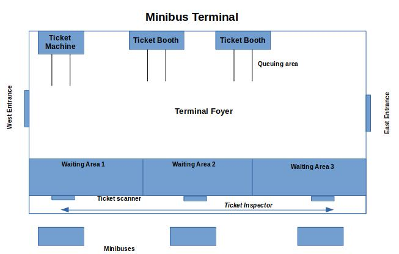

# **Asia Pacific Bus Terminal**
Individual assignment project on Concurrent Programming

Asia Pacific Bus Terminal (APBT) is a small transport hub servicing the community around Bukit
Jalil and Sri Petaling. At APBT customers can purchase tickets for travel on one of the frequent
minibuses that transport up to 15 passengers on short journeys around KL and the surrounding
area. The terminal has two ticket counters manned by ticket personnel, from which customers
can purchase their tickets. The terminal has also installed an automated ticketing machine
although it is unreliable and prone to breakdown.

# Part 1
Customers arrive from the West and East entrances and have to queue at the ticket machine
or one of the ticket booths. Due to social distancing, the line to the ticket machine and
ticketing booths can only accommodate 5 people in line, with the remainder having to wait in
the terminal foyer. The ticketing machine takes 4 seconds to issue a ticket, and the ticketing
booth takes 8 seconds. Once in possession of a ticket travellers may proceed to one of three
departure gates (depending on their direction of travel) and wait in the waiting area until their
minibus arrives. It is assumed that the waiting areas are always available for the purposes of
this simulation.

# Part 2

Passengers arrive periodically into the terminal foyer after purchasing their tickets. There are 3
waiting areas and each waiting area can accommodate 10 people, with the remainder having
to wait in the terminal foyer. Prior to boarding a minibus passenger must scan their
temperature at a scanner for 5 seconds and have the ticket checked by the ticket inspector
which takes 2 seconds (this can happen in any order). Unfortunately, due to staff shortages
the terminal currently only employs one ticket inspector, who must go back and forth between
each of the departure gates.

# Part 3
Busses to each destination arrive every 10 seconds, stay at the terminal for 10 seconds and
depart the terminal. Passengers are required to queue to board the bus, and the bus can load
one passenger every 1 second. Due to social distancing requirements, the minibuses can only
be loaded up to 50% of its capacity of 12 passengers. The bus driver will count the number of
passengers boarding and stop the passengers from boarding once the capacity is reached.
Remaining passengers will have to continue to wait in the designated waiting area for the next
bus. There are 3 waiting areas and each waiting area can accommodate 10 people, with the
remainder having to wait in the terminal foyer.

# Basic requirements

As the terminal is relatively small in size it is important to manage the number of people inside
the building at any one time for health and safety purposes. Currently the building is capable
of handling 50 individuals at any one time (excluding staff), thus should the building reach its
max capacity guards at each of the two entrances are instructed to prevent people from
entering the terminal. New entrants will be prohibited until such time as the number of
people inside the terminal has fallen to below 70% max capacity.

<b> Figure 1: Inside layout of the Asia Pacific Bus Terminal <b>

 </img>

Deliverables:
For this exercise, you are to model the bus terminal scenario and implement a Java program to
simulate activity for the terminal:
1. Customers entering the terminal building, purchasing tickets
a. With staff operating the ticket booths,
2. Waiting for a bus
a. With the ticket inspector checking tickets
3. Boarding a bus.
a. With the bus driver limiting passengers on board each bus.
Assume passengers only depart from the terminal (i.e. no one leaves via the entrances, and no
one disembarks from each minibus)

# Additional requirements

Altogether, 150 customers should try to enter the building.

Use a random number generator, so a new customer arrives every 1, 2, 3, or 4 seconds. (This
might be accomplished by an appropriate statement e.g. sleep (1+ (rand () %4)).

For each part, simulate scenarios in which:

Part 1: 

• The ticketing machine in not working – thereby requiring any queuing customers to
shift to one of the ticketing booths

• One or more ticketing booth staff are on a toilet break

• The terminal has reached max capacity

Part 2:

• The waiting area is full

• The ticket inspector goes on a toilet break

• The terminal has reached max capacity

Part 3:

• The waiting area is full

• Buses are delayed in arriving at the terminal

• Buses only leaving when reaching it’s capacity

• The terminal has reached max capacity

# Optional - Bonus Marks:

Bonus marks (5 marks) are available for those students who manage to implement and
integrate any 2 parts or more above as a single terminal, as well as simulating the arrival and
departure of customers!